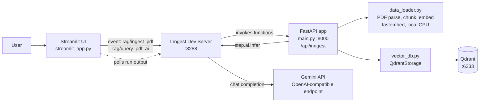
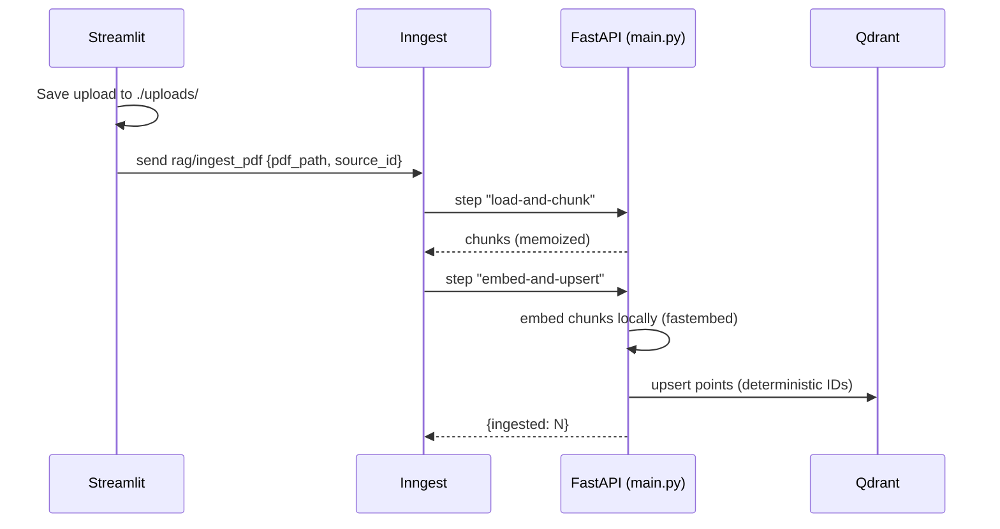
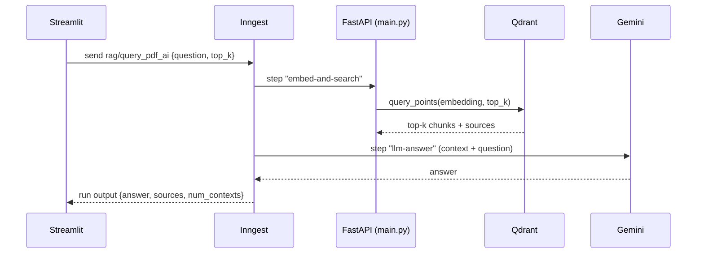

# Science RAG Analyzer

A Retrieval-Augmented Generation (RAG) system that turns science PDFs (notes, textbooks, past papers) into a searchable knowledge base, so integrated science students can ask questions and get answers grounded in their own study material.

- **Ingest** a PDF: it is split into chunks, embedded locally, and stored in a vector database.
- **Ask** a question: the most relevant chunks are retrieved and handed to an LLM, which answers using only that context and cites the source PDF.

Both workflows run as durable [Inngest](https://www.inngest.com/) functions behind a FastAPI app, with a Streamlit front end.

---

## Table of contents

1. [Architecture](#architecture)
2. [Tech stack](#tech-stack)
3. [Project structure](#project-structure)
4. [Getting started](#getting-started)
5. [Configuration](#configuration)
6. [Usage](#usage)
7. [Event and function reference](#event-and-function-reference)
8. [Module reference](#module-reference)
9. [Design decisions](#design-decisions)
10. [Troubleshooting](#troubleshooting)
11. [Known limitations and roadmap](#known-limitations-and-roadmap)

---

## Architecture



### Ingest flow



### Query flow



---

## Tech stack

| Concern                | Technology                                                                                                                                 |
| ---------------------- | ------------------------------------------------------------------------------------------------------------------------------------------ |
| Language / packaging   | Python 3.12+, [uv](https://docs.astral.sh/uv/)                                                                                             |
| API server             | FastAPI + Uvicorn                                                                                                                          |
| Workflow orchestration | Inngest (Python SDK, dev server)                                                                                                           |
| PDF parsing            | `llama-index-readers-file` (`PDFReader`)                                                                                                   |
| Chunking               | `llama-index-core` `SentenceSplitter`                                                                                                      |
| Embeddings             | [fastembed](https://github.com/qdrant/fastembed), model `BAAI/bge-small-en-v1.5` (384 dims, runs locally on CPU, no API key or rate limit) |
| Vector database        | Qdrant (Docker), cosine distance                                                                                                           |
| LLM                    | Gemini (`gemini-3.8-flash`) via its OpenAI-compatible endpoint                                                                             |
| Front end              | Streamlit                                                                                                                                  |

---

## Project structure

```
.
├── main.py              # FastAPI app + Inngest functions (ingest and query workflows)
├── data_loader.py       # PDF loading, chunking, local embedding
├── vector_db.py         # Qdrant wrapper (collection setup, upsert, search)
├── custom_types.py      # Pydantic models passed between Inngest steps
├── streamlit_app.py     # Upload + question UI; talks to Inngest
├── pyproject.toml       # Dependencies and project metadata
├── uv.lock              # Locked dependency versions
├── .env                 # Secrets (not committed)
├── uploads/             # PDFs saved by the Streamlit app (not committed)
├── qdrant_storage/      # Qdrant's on-disk data (Docker volume, not committed)
└── .fastembed_cache/    # Downloaded embedding model (not committed)
```

---

## Getting started

### Prerequisites

| Tool                             | Why                         | Check                                            |
| -------------------------------- | --------------------------- | ------------------------------------------------ |
| Python 3.12+                     | Runtime                     | `python3 --version`                              |
| [uv](https://docs.astral.sh/uv/) | Dependency management       | `uv --version`                                   |
| Docker                           | Runs Qdrant                 | `docker --version`                               |
| Node.js (for `npx`)              | Runs the Inngest dev server | `npx --version`                                  |
| Gemini API key                   | Answer generation           | [Google AI Studio](https://aistudio.google.com/) |

### 1. Install dependencies

```bash
uv sync
```

### 2. Create `.env`

```env
GEMINI_API_KEY=your_gemini_key_here
```

Never commit this file. It is already listed in `.gitignore`.

### 3. Start Qdrant

```bash
docker run -d --name qdrantRagDb \
  -p 6333:6333 \
  -v "$(pwd)/qdrant_storage:/qdrant/storage" \
  qdrant/qdrant
```

Make it survive reboots:

```bash
docker update --restart unless-stopped qdrantRagDb
```

Verify it is up:

```bash
curl http://localhost:6333/collections
```

If the container already exists but is stopped, use `docker start qdrantRagDb`.

### 4. Start the services

Run each in its own terminal, from the project root, in this order:

```bash
# Terminal 1: API server (registers the Inngest functions)
uv run uvicorn main:app

# Terminal 2: Inngest dev server
npx inngest-cli@latest dev -u http://127.0.0.1:8000/api/inngest --no-discovery

# Terminal 3: UI
uv run streamlit run streamlit_app.py
```

Open the Inngest dashboard at <http://127.0.0.1:8288> and confirm that **RAG: Ingest PDF** and **RAG: Query PDF** are listed under _Functions_.

The first ingest downloads the embedding model (about 70 MB) into `.fastembed_cache/`, so it needs internet once.

---

## Configuration

### Environment variables

| Variable           | Required | Default                    | Purpose                                  |
| ------------------ | -------- | -------------------------- | ---------------------------------------- |
| `GEMINI_API_KEY`   | Yes      | none                       | Authenticates the answer-generation call |
| `INNGEST_API_BASE` | No       | `http://127.0.0.1:8288/v1` | Where Streamlit polls for run results    |

### Constants in code

| Constant                                      | File             | Value                    | Meaning                            |
| --------------------------------------------- | ---------------- | ------------------------ | ---------------------------------- |
| `EMBED_MODEL`                                 | `data_loader.py` | `BAAI/bge-small-en-v1.5` | Local embedding model              |
| `EMBED_DIM`                                   | `data_loader.py` | `384`                    | Must match the model's output size |
| `SentenceSplitter(chunk_size, chunk_overlap)` | `data_loader.py` | `1000`, `200`            | Chunking (measured in tokens)      |
| `collection` / `dim`                          | `vector_db.py`   | `docs_local`, `384`      | Qdrant collection and vector size  |
| `GEMINI_CHAT_MODEL`                           | `main.py`        | `gemini-3.8-flash`       | LLM used for answers               |
| `max_tokens`, `temperature`                   | `main.py`        | `2048`, `0.2`            | Generation settings                |

> **Important:** the Qdrant collection's vector size is fixed when it is created. If you change the embedding model, change `dim` **and** use a new collection name (or delete the old collection). Vectors from different models cannot be compared.

---

## Usage

### Through the UI

1. Open the Streamlit URL (usually <http://localhost:8501>).
2. **Upload a PDF.** Ingestion starts automatically. A success message only means the event was sent. Watch the uvicorn terminal for `[UPSERT] stored N chunks`.
3. **Ask a question** once ingestion has finished, choose how many chunks to retrieve (default 5), and press _Ask_.

### Directly through Inngest (no UI)

In the Inngest dashboard, open the function and choose _Invoke_, then pass a payload like:

```json
{
  "data": {
    "pdf_path": "/absolute/path/to/notes.pdf",
    "source_id": "notes.pdf"
  }
}
```

For a query:

```json
{
  "data": {
    "question": "What is the difference between a physical and a chemical change?",
    "top_k": 5
  }
}
```

---

## Event and function reference

### `RAG: Ingest PDF`

|               |                                                                                                                           |
| ------------- | ------------------------------------------------------------------------------------------------------------------------- |
| Function ID   | `RAG: Ingest PDF`                                                                                                         |
| Trigger event | `rag/ingest_pdf`                                                                                                          |
| Input `data`  | `pdf_path` (str, required, absolute path readable by the API server), `source_id` (str, optional, defaults to `pdf_path`) |
| Steps         | `load-and-chunk` then `embed-and-upsert`                                                                                  |
| Output        | `{"ingested": <number of chunks stored>}`                                                                                 |

### `RAG: Query PDF`

|               |                                                                |
| ------------- | -------------------------------------------------------------- |
| Function ID   | `RAG: Query PDF`                                               |
| Trigger event | `rag/query_pdf_ai`                                             |
| Input `data`  | `question` (str, required), `top_k` (int, optional, default 5) |
| Steps         | `embed-and-search` then `llm-answer`                           |
| Output        | `{"answer": str, "sources": [str], "num_contexts": int}`       |

The LLM is instructed to answer **only** from the retrieved context.

---

## Module reference

### `data_loader.py`

- `load_and_chunk_pdf(path: str) -> list[str]`: reads the PDF page by page with `PDFReader`, drops empty pages, and splits each page's text into chunks. Returns an empty list for image-only PDFs.
- `embed_texts(texts: list[str]) -> list[list[float]]`: embeds texts with the local fastembed model. Used for both document chunks and user questions.

### `vector_db.py`

`QdrantStorage(url, collection, dim)` creates the collection if it does not exist.

- `upsert(ids, vectors, payloads)`: stores points. Each payload is `{"source": <source_id>, "text": <chunk>}`.
- `search(query_vector, top_k=5) -> {"contexts": [...], "sources": [...]}`: returns the matching chunk texts and the de-duplicated set of source names.

### `custom_types.py`

Pydantic models that carry data between Inngest steps: `RAGChunkAndSrc`, `RAGUpsertResult`, `RAGSearchResult`, `RAGQueryResult`. They are serialized through `inngest.PydanticSerializer()`.

### `main.py`

Defines the Inngest client, the two functions above, and mounts them on FastAPI at `/api/inngest`. Each step logs progress (`[LOAD]`, `[EMBED]`, `[UPSERT]`, `[SEARCH]`) and a full traceback on failure to the uvicorn terminal.

### `streamlit_app.py`

- Saves uploads to `./uploads/` and sends `rag/ingest_pdf` with the file's absolute path.
- Sends `rag/query_pdf_ai`, then polls `GET /v1/events/{event_id}/runs` on the Inngest dev server until the run completes (120 s timeout) and displays the answer and sources.

---

## Design decisions

- **Inngest for orchestration.** Each step's result is memoized, so a failure in a later step does not redo earlier work, and every run is inspectable in the dashboard.
- **Local embeddings.** Ingestion makes one embedding per chunk, which is exactly where hosted free tiers hit rate limits. Running `bge-small` locally removes the quota, the cost, and the network dependency for ingestion and retrieval. Only answer generation calls an external API, once per question.
- **Deterministic point IDs.** IDs are `uuid5("{source_id}:{chunk_index}")`, so re-ingesting the same PDF overwrites its points instead of creating duplicates.
- **Embed and upsert in one step.** Keeping vectors out of step output avoids storing multi-megabyte payloads in Inngest.
- **Pydantic types between steps.** Typed, validated step outputs with `output_type=`.
- **Gemini through the OpenAI-compatible endpoint.** Lets the Inngest `ai.openai.Adapter` be reused by changing only `base_url`, key, and model.

---

## Troubleshooting

| Symptom                                              | Cause                                         | Fix                                                                             |
| ---------------------------------------------------- | --------------------------------------------- | ------------------------------------------------------------------------------- |
| `Connection refused` on port 6333 in the uvicorn log | Qdrant is not running                         | `docker start qdrantRagDb`, then `curl localhost:6333/collections`              |
| Functions missing in the Inngest dashboard           | Inngest cannot reach the API                  | Start uvicorn first and use `-u http://127.0.0.1:8000/api/inngest`              |
| Repeating `PUT /api/inngest` lines every 5 s         | Dev server auto-discovery                     | Harmless. Add `--no-discovery` to stop it                                       |
| `Function run Failed` in Streamlit                   | A step raised an exception                    | Read the traceback in the uvicorn terminal or the failed step in the Inngest UI |
| `404 ... model is no longer available`               | Gemini retired the model                      | Update `GEMINI_CHAT_MODEL` in `main.py` to a current model                      |
| `429 Too Many Requests` from Gemini                  | Free-tier rate limit on answers               | Wait a minute between questions, or enable billing                              |
| `No text extracted from PDF`                         | Scanned or image-only PDF                     | OCR the PDF first (for example with `ocrmypdf`)                                 |
| Vector size mismatch error from Qdrant               | Collection was created with a different `dim` | Use a new collection name or delete the old collection                          |
| Empty or missing answer                              | LLM spent its token budget before answering   | Raise `max_tokens` in `main.py`                                                 |
| `AttributeError: ... no attribute 'search'`          | Old Qdrant call                               | This project uses `query_points`, so make sure `vector_db.py` is current        |

---

## Known limitations and roadmap

**Known limitations**

- **Chunk size vs. embedder limit.** Chunks are up to 1000 tokens, but `bge-small-en-v1.5` reads at most 512 tokens per input, so the end of long chunks is silently ignored when embedding. Recommended: `chunk_size=400`, `chunk_overlap=80`, then re-ingest.
- **Image-only PDFs are not supported** (no OCR).
- **Same-machine assumption.** Streamlit passes a local file path, so the UI and API must share a filesystem.
- **Single shared collection.** All PDFs live together, with no per-subject or per-student filtering and no way to delete one document through the UI.
- **Development mode only.** `is_production=False`, no authentication, no Inngest signing or event keys.
- **No automated tests.**

**Roadmap ideas**

- Filter retrieval by `source` (choose which PDF to ask about)
- Show the retrieved chunks next to the answer
- OCR fallback for scanned PDFs
- Document management (list and delete ingested PDFs)
- Quiz and revision-question generation from retrieved context
- Unit tests for chunking and retrieval, plus a small evaluation set of question/answer pairs

---

## Housekeeping

Recommended `.gitignore` entries:

```
.env
__pycache__/
*.pyc
.venv/
uploads/
qdrant_storage/
.fastembed_cache/
```

## License

See [LICENSE](LICENSE).
