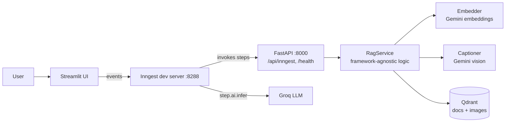
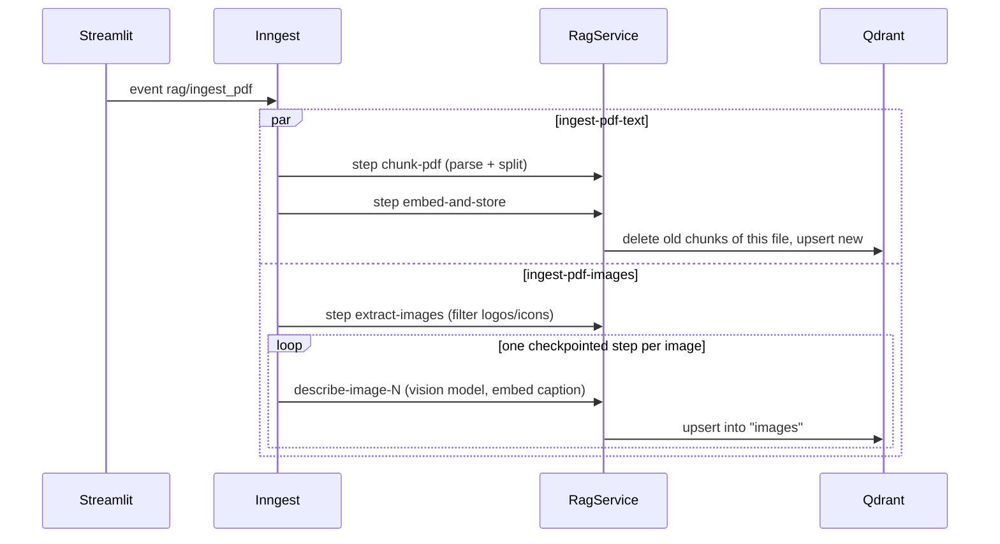
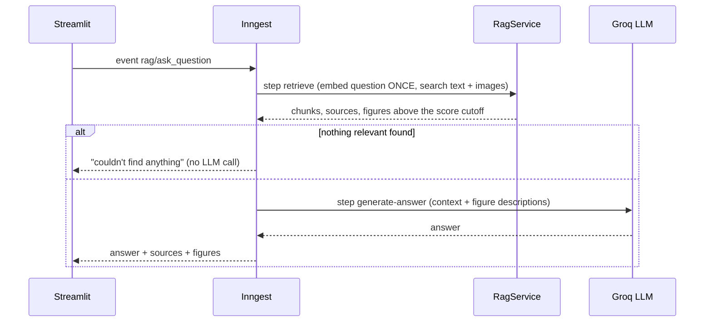

# Science RAG Analyzer

[](https://github.com/YOUR_USERNAME/science-rag-analyzer/actions)


**A multimodal retrieval-augmented generation (RAG) system that lets students ask questions about their science notes and get a grounded answer, the sources it came from, and the matching diagrams, graphs and drawings.**

Upload a PDF. Its text *and* pictures are indexed. Ask "How does the water cycle work?" and get a concise answer written only from your notes, cited by file, with the relevant figure shown underneath.

> Built for integrated science students at junior-secondary level, but nothing in the pipeline is science-specific. It works on any set of PDFs and images.

<!-- Add real screenshots or a short GIF here: this is the first thing recruiters look at.
 -->

---

## Why this project is interesting (engineering highlights)

| Concern | What I built | Where |
|---|---|---|
| **Durable, observable workflows** | Ingestion and Q&A run as [Inngest](https://www.inngest.com/) functions. Every step is checkpointed, retried with backoff, and inspectable in a dashboard. A failure in step 3 never repeats steps 1 and 2. | `workflows.py` |
| **Multimodal retrieval** | A vision model turns each diagram, graph or drawing into a searchable description (type, labels, axes, concept). Descriptions are embedded with the same model as the text, so one question searches both. | `vision.py`, `service.py` |
| **Idempotent ingestion** | Deterministic point IDs plus delete-by-source mean re-uploading a document replaces it cleanly: no duplicates, no stale chunks. | `service.py`, `vector_store.py` |
| **Testable architecture** | Business logic is framework-agnostic and depends on small protocols (`Embedder`, `Captioner`). The full pipeline is tested offline with fakes and an in-memory vector DB. No API keys needed to run the tests. | `service.py`, `tests/` |
| **Resilience to flaky APIs** | Linear backoff for 429/503, small batches, pauses between image calls, and non-retriable errors for problems retrying cannot fix (missing file, scanned PDF). | `retry.py`, `workflows.py` |
| **Guard rails against hallucination** | Prompt restricts answers to retrieved context; if nothing relevant is retrieved, the LLM call is skipped entirely; images below a similarity cutoff are not shown. | `prompts.py`, `workflows.py` |
| **Measure, don't guess** | A retrieval evaluation harness reports hit rate@k and MRR on your own question set. | `evaluation.py` |
| **Fails loudly, early** | Switching embedding models without rebuilding the collection raises a clear dimension-mismatch error instead of returning nonsense. | `vector_store.py` |

---

## Architecture



### Ingestion (one upload triggers two independent workflows)



### Question answering



---

## Tech stack

| Layer | Technology |
|---|---|
| Language / tooling | Python 3.12, [uv](https://docs.astral.sh/uv/), Ruff, pytest |
| API | FastAPI, Uvicorn |
| Orchestration | Inngest (Python SDK): durable steps, retries, fan-out |
| PDF parsing | llama-index PDFReader, PyMuPDF (image extraction) |
| Chunking | llama-index `SentenceSplitter` (sentence-aware, token-sized, overlapping) |
| Embeddings and vision | Google Gemini (via its OpenAI-compatible API) |
| Answer generation | Groq (`openai/gpt-oss-120b` by default) |
| Vector database | Qdrant (cosine similarity, payload index on `source`) |
| UI | Streamlit |
| Data models | Pydantic v2 |
| CI | GitHub Actions (lint, format check, tests) |

---

## Getting started

### Prerequisites

- Python 3.12+ and [uv](https://docs.astral.sh/uv/)
- Docker (for Qdrant)
- Node.js (only to run the Inngest dev server via `npx`)
- A [Gemini API key](https://aistudio.google.com/) and a [Groq API key](https://console.groq.com/) (both have free tiers)

### Setup

```bash
git clone https://github.com/YOUR_USERNAME/science-rag-analyzer.git
cd science-rag-analyzer

cp .env.example .env        # then add your two API keys
make install                # uv sync --all-groups
make qdrant                 # docker compose up -d qdrant
```

### Run (three terminals)

```bash
make api        # terminal 1: FastAPI + Inngest endpoint   -> http://127.0.0.1:8000
make inngest    # terminal 2: Inngest dev server           -> http://127.0.0.1:8288
make ui         # terminal 3: Streamlit                    -> http://localhost:8501
```

Check `http://127.0.0.1:8000/health` (should report Qdrant `up`) and the Inngest dashboard (should list four functions).

### Use it

1. **Upload a PDF.** Text and pictures are ingested in parallel (progress: Inngest dashboard).
2. **Upload a standalone picture, graph or drawing** if you want to index one directly.
3. **Ask a question.** You get the answer, source files, and related figures.

### Without the UI or Inngest

```bash
uv run python scripts/ingest.py path/to/notes.pdf            # text + images
uv run python scripts/ingest.py path/to/folder --text-only
uv run python scripts/query.py "how does the water cycle work"   # retrieval only, shows scores
uv run python scripts/eval_retrieval.py eval/cases.jsonl -k 5    # retrieval quality
```

---

## Configuration

All settings are environment variables (see `.env.example`). Defaults live in `src/science_rag/config.py`.

| Variable | Default | Purpose |
|---|---|---|
| `GEMINI_API_KEY` | none (required) | Embeddings and image descriptions |
| `GROQ_API_KEY` | none (required) | Answer generation |
| `QDRANT_URL` | `http://localhost:6333` | Vector database |
| `CHAT_MODEL` | `openai/gpt-oss-120b` | LLM that writes the answer |
| `VISION_MODEL` | `gemini-3.8-flash` | Describes images |
| `EMBED_MODEL` / `EMBED_DIM` | `gemini-embedding-001` / `3072` | Must match the collection's vector size |
| `CHUNK_SIZE` / `CHUNK_OVERLAP` | `1000` / `200` | Chunking, in tokens |
| `TOP_K` | `5` | Text chunks retrieved per question |
| `IMAGE_TOP_K` | `3` | Maximum figures returned |
| `MIN_IMAGE_SCORE` | `0.55` | Similarity cutoff for showing a figure (tune with `scripts/query.py`) |
| `RENDER_DRAWING_PAGES` | `false` | Also screenshot pages whose graphs are vector drawings |

Model names change over time; if a provider returns "model not found", update the matching variable.

---

## Project structure

```
src/science_rag/
├── config.py         # typed settings from environment, no import-time side effects
├── models.py         # Pydantic models passed between steps
├── events.py         # event names shared by API and UI
├── embeddings.py     # Embedder protocol + Gemini implementation
├── vision.py         # Captioner protocol + Gemini implementation
├── pdf_text.py       # PDF -> chunks
├── pdf_images.py     # PDF -> filtered PNG files
├── vector_store.py   # typed Qdrant wrapper (upsert, search, delete by source)
├── service.py        # RagService: all business logic, no framework code
├── prompts.py        # pure prompt-building functions
├── evaluation.py     # hit rate@k and MRR
├── retry.py          # backoff helper
├── workflows.py      # Inngest functions (thin orchestration)
└── app.py            # FastAPI app: Inngest endpoint + /health
ui/streamlit_app.py   # front end (talks only to Inngest)
scripts/              # CLI tools: ingest, query, evaluate
tests/                # offline unit + integration tests
```

---

## Testing and quality

```bash
make test     # pytest
make lint     # ruff check
make format   # ruff format
```

- The whole pipeline is covered **offline**: a hashing-based fake embedder, a fake captioner and an in-memory Qdrant stand in for the real services, so tests need no API keys or network and run in seconds.
- Covered behaviour includes retrieval ranking, score cutoffs, idempotent re-ingestion, stale-chunk removal, logo/icon filtering, scanned-PDF errors, retry/backoff, prompt construction, evaluation metrics, config parsing, and the health endpoint.
- CI runs lint, format check and tests on every push.

---

## Evaluation

Retrieval quality is measured, not assumed. Put real questions in a JSONL file:

```json
{"question": "What is photosynthesis?", "expected_substring": "chlorophyll"}
```

```bash
uv run python scripts/eval_retrieval.py eval/cases.jsonl -k 5
```

It reports `hit_rate@k` (was a correct chunk retrieved?) and `MRR` (how high was it ranked?). Run it before and after changing chunk size, `TOP_K` or the embedding model to see the effect on your own documents.

<!-- After running it on your own notes, add the real numbers here, for example:
| Setting | hit_rate@5 | MRR | -->

---

## Design decisions and trade-offs

- **Captions instead of image embeddings.** Searching is text-to-text: a vision model describes each figure and the description is embedded with the same model as the notes. This reads labels and axes inside diagrams, which generic image-embedding models such as CLIP handle poorly. The trade-off is one vision call per image and a dependency on description quality.
- **Inngest instead of a plain background queue.** Durable steps, per-step retries and a run inspector replaced a lot of hand-written retry and status-tracking code. The trade-off is an extra service to run locally.
- **Embed and store in one step.** Each vector holds 3,072 numbers; keeping vectors out of step output avoids persisting megabytes of JSON per run.
- **Pauses between image steps.** Free-tier APIs have per-minute limits; `step.sleep` spaces calls without holding a worker.
- **One embedding call per question** serves both the text and the image search.
- **Protocols over inheritance.** `Embedder` and `Captioner` are structural types, so a local model (for example `fastembed`) can be dropped in without changing the service.
- **Re-embedding is explicit.** Vectors from different models are not comparable, so the vector store refuses to open a collection whose dimension differs from the embedder's.

## Challenges and what I learned

- **Rate limits (HTTP 429).** Sending 50 large chunks per embedding request exhausted the provider's per-minute token budget. Fixed with smaller batches, backoff, and checkpointed per-item steps.
- **Blocking code in an async server.** Sleeping inside retry logic froze the event loop (and Inngest's registration polling). Fixed by running blocking work in worker threads.
- **LLM calls are invisible to the app.** `step.ai.infer` is executed by the Inngest server, so its errors never appeared in my API logs; diagnosing them required the Inngest run inspector.
- **A library removed an API I relied on.** `qdrant-client` dropped `search()`; I moved to `query_points` and cover retrieval with tests so a future API change fails in CI, not in production.
- **Silent embedder truncation.** Chunks longer than a small local model's input limit lose their tails without any error. This is why chunk size is configurable and why dimension checks fail loudly.

## Security notes

- API keys are read from the environment; `.env` is git-ignored and `.env.example` documents every variable.
- Uploaded file names are reduced to their base name before saving.
- **Known limitation:** ingestion events carry a local file path. This is fine for a single-user tool but would need an allow-listed upload directory (or object storage) before exposing the API publicly.
- Retrieved document text is passed to the LLM, so a hostile PDF could contain prompt-injection text. The system prompt restricts answers to the context, but this is mitigation, not a guarantee.
- No documents or extracted images are committed; `data/`, `uploads/`, `images/` and `qdrant_storage/` are git-ignored. Only ingest material you have the right to use.

## Known limitations and roadmap

- [ ] Scanned PDFs need OCR first (an `ocrmypdf` pre-processing step is the planned fix)
- [ ] Hybrid search (BM25 + vectors) and a reranker for better precision
- [ ] Page numbers and highlighted passages in text citations
- [ ] Authentication and per-user collections (multi-tenancy)
- [ ] Object storage for uploads and extracted images instead of the local disk
- [ ] Streaming answers to the UI
- [ ] Quiz and revision-question generation from retrieved context
- [ ] Containerise the API and UI; deploy with the Inngest cloud
- [ ] Mobile client (Flutter) consuming the same events API

## License

See [LICENSE](LICENSE).

## Author

**Your Name** · [LinkedIn](https://www.linkedin.com/in/YOUR_PROFILE) · [Portfolio](https://YOUR_SITE) · you@example.com
